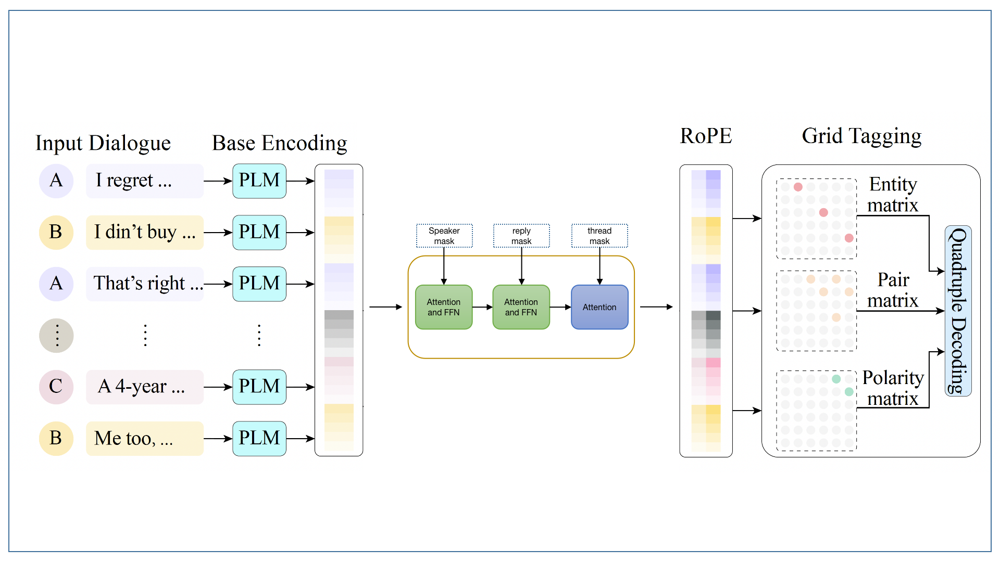
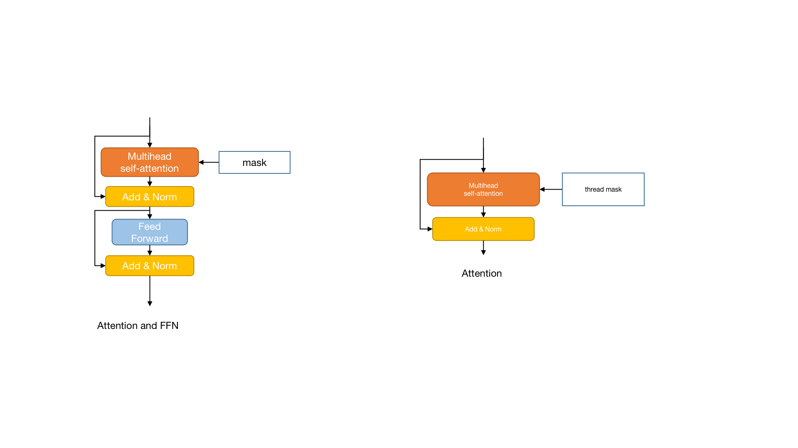

## Archecture

Figure 1: archecture of the model.
The input dialogue for both languages are encoded by the same encoder, namely macbert-large[1], and the output of the encoder is fed into three consecutive attention modules, as shown in the figure.  The first two attention modules contain multi-head attention and feed-forward network(FFN), and they capture speaker and reply relations using speaker mask and reply mask resptively.

The last module (in blue) contains a multi-head attention only, as we found that adding FFN degrades the performance (see ablation study), and thread mask is used to capture the thread relation.

The output of the last attention module is fed into the RoPE and grid tagging modules as in the DiaASQ implementation[2].

## Attention modules

figure 2: attention module.
The attention module is composed of multi-head attention and feed-forward network(FFN).  The multi-head attention is the same as the one in the transformer[3], and the FFN(for the first two attention modules in Figure 1) is a two-layer MLP with GELU activation.

## Cross validation and model fusion
We randomly split the training data into 5 folds, and train the model on each fold. For each fold, we select the best model on the validation set and use the weight for model fusion. The model fusion is done by averaging the weights of the selected models. Note that we only select the top 3 models among the 5 folds, as we found that using more models degrades the performance.

## Language transfer

We found that transfer learning from Chinese to English is effective, and we use the following method to transfer the model from Chinese to English. First, we train the model on Chinese data using cross-validation and model fusion(as described above). Then we use the fused Chinese model to initialize the parameters of the English model. Finally, the English model is trained as usual.  We found that this method is more effective than training the model from scratch on English data.

## References

[1] Yiming Cui, et.al, 2020. Revisiting Pre-Trained Models for Chinese Natural Language Processing. In Findings of the Association for Computational Linguistics: EMNLP 2020, pages 657–668, Online. Association for Computational Linguistics.
[2] Bobo Li et.al, 2023. DiaASQ : A Benchmark of Conversational Aspect-based Sentiment Quadruple Analysis. In Findings of ACL 2023.
